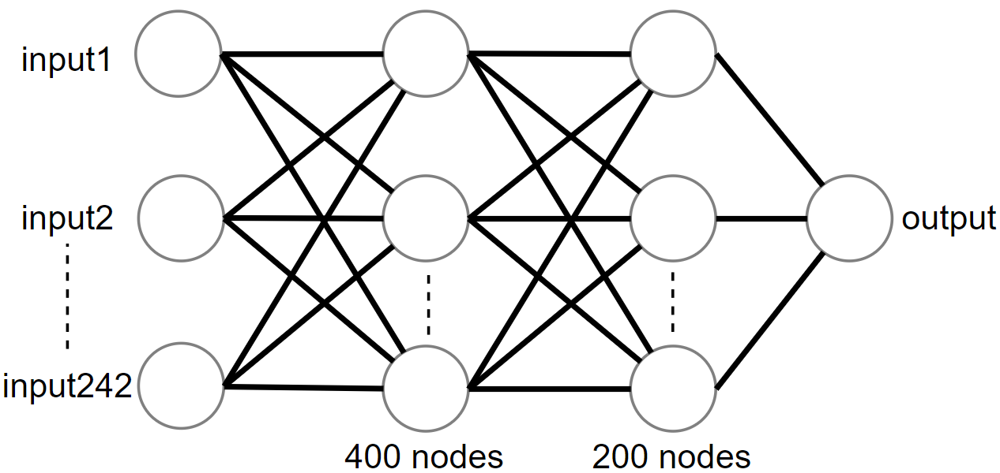
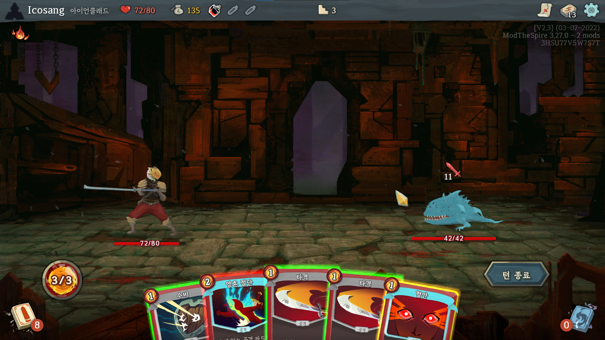

# Light-the-Spire
This is a project about recommending proper cards on 'Slay The Spire' by using machine learning.

To train model, crawl battle datasets from 'spirelogs.com' and pre-process datasets to cards sequence and HP loss pair. 

The trained model predicts  HP loss from sequence of cards on the deck. Then, it recommends proper cards based on HP loss.

# Steps of preprocessing and learning data.
1. Crawl datasets from 'spirelogs.com'.
2. Classify datasets by each monster and ascension.
3. Train the HP loss data on each deck, conditioned on each monster and ascension. The model would be trained to reduce HP loss.
4. Load and inference the trained model on Java. Apply to 'Slay The Spire' java mod. (co-work with https://gitlab.com/icosa1/lightthespire)

# Structure of the recommending proper cards model.

Multi layered perceptron structure was used in this project.

There are two dense layers and two dropout layers. The input is a sequence of card in each deck and output is a value of HP loss.

# Information about each .py file
crawl_test.py : Crawling data from 'spirelogs.com'

data setup1.py: Pre-processing and saving data from crawled data ('20190201003826_1548999484.run.json'). Example format of saved file is same as '1.json'.
(This file is based on https://github.com/alexdriedger/SlayTheSpireFightPredictor)

data setup2.py : Load pre-processed data ('1.json') and save as .csv format for training data ('Jaw Worm_0.csv').

training_test.py : Load training data ('Jaw Worm_0.csv') and training. After training, the model can be saved and be loaded. HP loss for each card can be predicted by a trained model.

# A screenshot of recommending proper cards

- Green bounding box means to strongly recommend this card.
- Yellow bounding box means to weakly recommend this card.
- Red bounding box means to do not recommend this card.
